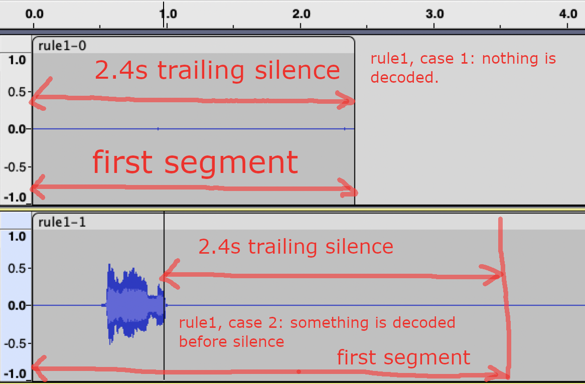
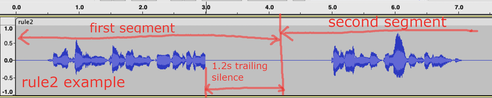
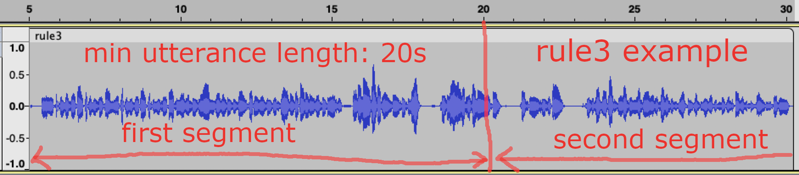

# 端点检测 - sherpa 1.3 文档

我们为端点检测制定了三条规则。如果触发了任何一条规则，我们就假定检测到了端点。

## 规则 1
在 `规则 1` 中，我们计算尾随静音的持续时间。如果它超过了用户指定的值，`规则 1` 就会被触发。

## 规则 2
在 `规则 2` 中，我们要求首先解码一些内容，然后我们才开始计算尾随静音的持续时间。在下面的例子中，解码一些内容后，当尾随静音的持续时间超过用户指定的值 `1.2` 秒时，`规则 2` 就会被触发。

## 规则 3
当话语长度（以秒为单位）超过给定值时，`规则 3` 就会被触发。

## 示例

## 常见问题
如何计算静音的持续时间？

